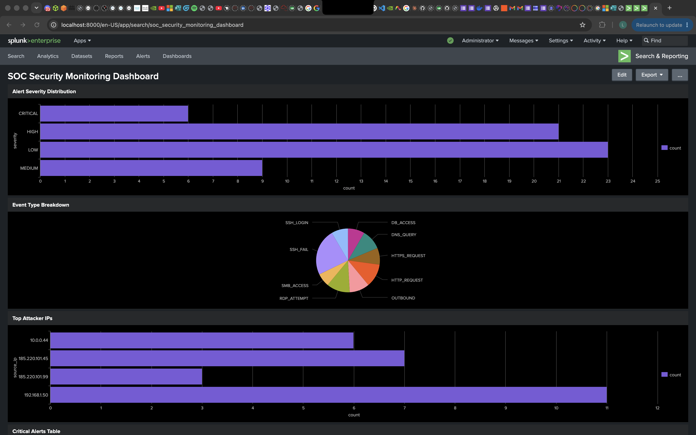
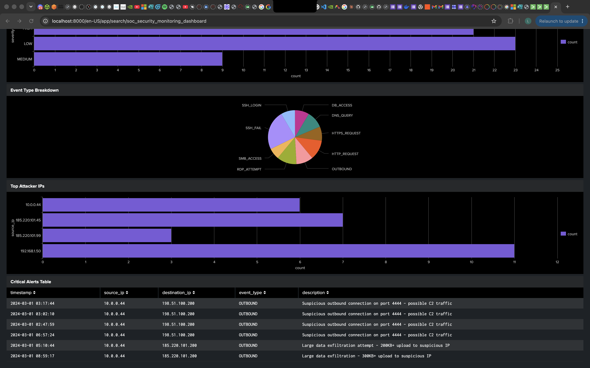

# 📊 Splunk SOC Security Monitoring Dashboard

> **Blue Team SOC Analyst Project** | SIEM Visualization · Threat Monitoring · Dashboard Design  
> Part of the [raphsec](https://github.com/raphsec) Blue Team Lab Roadmap

---

## 📌 Project Overview

This project involves building a **SOC Security Monitoring Dashboard** using Splunk Enterprise. Using a custom security log dataset of 59 events, I designed and built 4 interactive dashboard panels to visualise threat activity, attacker behaviour, and critical incidents — simulating a real-world SOC monitoring environment.

The goal was to practise:
- Building custom dashboards in Splunk Classic Dashboard builder
- Visualising security data using bar charts, pie charts, and tables
- Identifying threat patterns and attacker IPs from log data
- Presenting security findings in a clear, actionable format for SOC teams

---

## 🛠️ Tools & Environment

| Tool | Purpose |
|------|---------|
| Splunk Enterprise (Free Trial) | SIEM platform for dashboard building |
| SPL (Search Processing Language) | Query language powering each panel |
| CSV Security Log Dataset | 59 custom security events |
| macOS | Host machine |

---

## 📁 Repository Structure

```
splunk-soc-dashboard/
│
├── security_logs.csv       # Security event log dataset (59 events)
├── README.md               # Project documentation
└── screenshots/            # Dashboard screenshots
```

---

## 📊 Dashboard Panels

### Panel 1 — Alert Severity Distribution (Bar Chart)
```spl
source="security logs.csv" | stats count by severity
```
Visualises the distribution of alerts across severity levels — CRITICAL, HIGH, MEDIUM, and LOW. Gives an immediate overview of the threat landscape.

---

### Panel 2 — Event Type Breakdown (Pie Chart)
```spl
source="security logs.csv" | stats count by event_type
```
Shows the proportion of each event type across all 59 events — SSH_FAIL, RDP_ATTEMPT, OUTBOUND, DNS_QUERY, HTTP_REQUEST, HTTPS_REQUEST, SMB_ACCESS, DB_ACCESS, SSH_LOGIN.

---

### Panel 3 — Top Attacker IPs (Bar Chart)
```spl
source="security logs.csv" severity=HIGH OR severity=CRITICAL | stats count by source_ip
```
Identifies the most active threat actors by source IP. Key findings:
- `192.168.1.50` — 11 SSH brute force attempts (internal host)
- `185.220.101.45` — 7 RDP brute force attempts (Tor exit node)
- `10.0.0.44` — 6 CRITICAL outbound C2 connections (compromised internal host)
- `185.220.101.99` — 3 SSH attempts from Tor exit node

---

### Panel 4 — Critical Alerts Table (Statistics Table)
```spl
source="security logs.csv" severity=CRITICAL | table timestamp, source_ip, destination_ip, event_type, description
```
Displays all CRITICAL severity events in a structured table showing timestamp, source/destination IPs, event type, and full description — enabling fast incident triage and escalation decisions.

---

## 🚨 Key Findings from Dashboard

| Finding | Details | Severity |
|---------|---------|----------|
| Compromised Internal Host | `10.0.0.44` making repeated outbound connections on port 4444 to `198.51.100.200` — possible C2 traffic | 🔴 CRITICAL |
| Data Exfiltration Attempt | `10.0.0.44` uploading 200KB-300KB+ to suspicious external IPs | 🔴 CRITICAL |
| RDP Brute Force | `185.220.101.45` (Tor exit node) — 7 blocked RDP attempts against `10.0.0.5:3389` | 🟠 HIGH |
| SSH Brute Force (Internal) | `192.168.1.50` — 11 failed SSH attempts — possible insider threat or compromised machine | 🟠 HIGH |
| SSH Brute Force (External) | `185.220.101.99` (Tor exit node) — 3 SSH attempts | 🟠 HIGH |

---

## 📸 Screenshots

### Full SOC Dashboard


### Critical Alerts Table


---

## 🧠 Key Takeaways

- **Dashboards** turn raw log data into actionable intelligence — at a glance you can see where to focus attention
- **Pie charts** are great for understanding the overall threat mix — in this dataset OUTBOUND and SSH_FAIL dominated
- **Bar charts** for attacker IPs make it immediately obvious which hosts are generating the most malicious activity
- **Statistics tables** for CRITICAL alerts give the SOC team everything they need to escalate — timestamp, IPs, event type, and description in one view
- **Internal IPs** generating HIGH/CRITICAL events are often more dangerous than external ones — they indicate a compromised host inside the network

---

## 🔗 Related Projects

- [Splunk Alert Triage & Investigation Lab](https://github.com/raphsec/splunk-alert-triage-lab) — the companion project where the same dataset was used for hands-on alert triage and SPL threat hunting

---

## 🗺️ Part of Blue Team Roadmap

This is **Project 4** in my structured 10-project Blue Team lab roadmap.

| # | Project | Status |
|---|---------|--------|
| 1 | Home Cybersecurity Lab (Ubuntu + VirtualBox) | ✅ Complete |
| 2 | Docker Vulnerability Container (ThousandEyes CVE) | ✅ Complete |
| 3 | Splunk Alert Triage & Investigation Lab | ✅ Complete |
| 4 | Splunk SOC Security Monitoring Dashboard | ✅ Complete |
| 5 | Security Onion SIEM Home Lab | 🔄 In Progress |
| 6-10 | ELK Stack, Kali, Metasploit, Python Scripting... | 📅 Upcoming |

---

## 👤 Author

**Raphael** — Aspiring Blue Team SOC Analyst  
🔗 [GitHub](https://github.com/raphsec) · [LinkedIn](https://www.linkedin.com/in/raphsec) · [Portfolio](https://raphsec.github.io)
